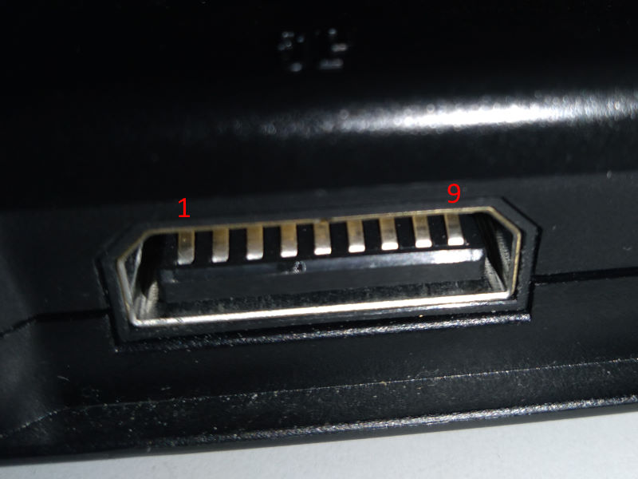

# SaturnMultiUSB

Convert Sega Saturn controllers to USB using an Arduino Leonardo.

Works with up to 2 controllers. And up to 7 if using one Multitap (6 Player Adaptor).

## Compatibility

It was tested with the following official accessories:
* Digital Pad
* 3D Analog Pad (digital and analog mode)
* Arcade Stick
* Twin Stick
* Multitap

RetroBit's wireless controller do not work when connected directly but works when using a Multitap.

## Usage

When powering up it will scan the ports for a Multitap.
If found, it will create 7 USB joystick. Otherwise 2.

So if you want to use a multitap make sure to connect it to the arduino before powering it.

After the power-on setup you can freely hot swap controllers.

Button mapping follows the PS3 standard for compatibility with the console.

## Connection

Saturn pins:

#### Saturn port 1

| Saturn  | Arduino | Description |
| ------- |-------- |------------ |
| 1       | 5V      | VCC/POWER   |
| 2       | A4      | D1/DATA 1   |
| 3       | A5      | D0/DATA 0   |
| 4       | A2      | S0/SEL/TH   |
| 5       | 7       | S1/REQ/TR   |
| 6       | A1      | S2/ACK/TL   |
| 7       | A0      | D3/DATA 3   |
| 8       | A3      | D2/DATA 2   |
| 9       | GND     | GROUND      |

#### Saturn port 2

| Saturn | Arduino | Description |
| -------|-------- |------------ |
| 1      | 5V      | VCC/POWER   |
| 2      | 3       | D1/DATA 1   |
| 3      | 2       | D0/DATA 0   |
| 4      | 8       | S0/SEL/TH   |
| 5      | 9       | S1/REQ/TR   |
| 6      | 5       | S2/ACK/TL   |
| 7      | 6       | D3/DATA 3   |
| 8      | 4       | D2/DATA 2   |
| 9      | GND     | GROUND      |

## Credits

My father for helping with the electronics stuff.

It uses the [ArduinoJoystickLibrary](https://github.com/MHeironimus/ArduinoJoystickLibrary) and the [DigitalWriteFast Library](https://github.com/NicksonYap/digitalWriteFast).

Inspired by raphnet's [saturn_usb](https://github.com/raphnet/saturn_usb).

Darthcloud's [Evolution of SEGA's IO Interface](https://hackaday.io/project/170365-blueretro/log/180790-evolution-of-segas-io-interface-from-sg-1000-to-saturn) article was an essential read to understand the protocol.

#### Warning
Code and wiring directions are provided to you 'as is' and without any warranties. Use at your own risk.